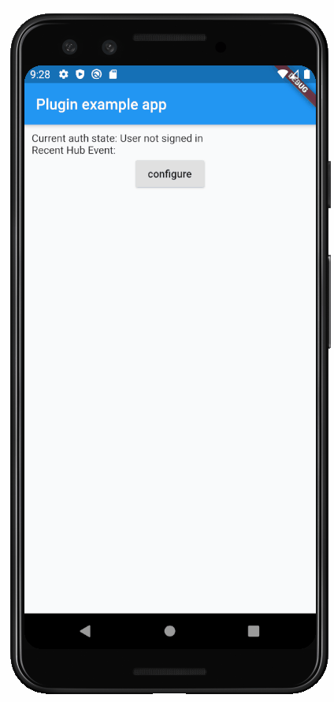

# Authentication Support for Flutter Apps with AWS Amplify

Id: 21-authentication-support-for-flutter-apps-with-aws-amplify
Author: ryandam
Summary: This post provides the steps required to setup authentication for Flutter apps using AWS Amplify.
Categories: AWS, Flutter, AWS Amplify, Authentication, Mobile Apps
Status: Draft
Feedback Link: ryandam.9@gmail.com

## Overview

The Amplify Flutter plugin helps to integrate Flutter Apps with the following AWS services:

- AWS Cognito
- AWS S3
- Amazon Pinpoint

In this post, we are going to use AWS Cognito integration. I followed the steps documented @ [Amplify Flutter](https://docs.amplify.aws/lib/q/platform/flutter) page. The objective of this post is to see what is happening behind the scenes when Amplify CLI commands run. Note that, as of today, Amplify Flutter is in preview mode.

## Setup

Platform Used - Windows 10

### Prerequisites

Following should be installed before using Amplify.

- Node.js
- npm
- git
- Flutter

### Verify the dependencies

```sh
C:\>node -v
v12.18.4

C:\>npm -v
6.14.6

C:\>git --version
git version 2.24.1.windows.2

C:\>flutter --version
Flutter 1.22.0 • channel beta • https://github.com/flutter/flutter.git
Framework • revision d408d302e2 (7 days ago) • 2020-09-29 11:49:17 -0700
Engine • revision 5babba6c4d
Tools • Dart 2.10.0
```

### Install AWS Amplify for Flutter

```sh
npm install -g @aws-amplify/cli@flutter-preview
```

```
...
----------------------------------------
Successfully installed the Amplify CLI
----------------------------------------

JavaScript Getting Started - https://docs.amplify.aws/start
Android Getting Started - https://docs.amplify.aws/start/q/integration/android
iOS Getting Started - https://docs.amplify.aws/start/q/integration/ios
Flutter Getting Started - https://docs.amplify.aws/start/q/integration/flutter
Amplify CLI collects anonymized usage data, which is used to help understand
how to improve the product. If you don't wish to send anonymized Amplify CLI
usage data to AWS, run amplify configure --usage-data-off  to opt-out.

...
+ @aws-amplify/cli@4.26.1-flutter-preview.0
added 1132 packages from 727 contributors in 82.102s
```

### Configure Amplify CLI

This step sets a profile for an IAM user locally. It requires an IAM user and access keys (Access Key ID and Secret Key).

During the process, AWS Web Console opens in a web browser, and then, tries to create an IAM user. But, we don't have to follow these. If an IAM user is already created with Admin access and we know their Access Key/Secret key, the browser windows can be closed.

```sh
C:\>amplify configure
```

```sh
Follow these steps to set up access to your AWS account:

Sign in to your AWS administrator account:
https://console.aws.amazon.com/
Press Enter to continue

Specify the AWS Region
? region:  us-east-2
Specify the username of the new IAM user:
? user name:  ryandam
Complete the user creation using the AWS console
https://console.aws.amazon.com/iam/home?region=undefined#/users$new?step=final&accessKey&userNames=ryandam&permissionType=policies&policies=arn:aws:iam::aws:policy%2FAdministratorAccess
Press Enter to continue

Enter the access key of the newly created user:
? accessKeyId:  ********************
? secretAccessKey:  ****************************************
This would update/create the AWS Profile in your local machine
? Profile Name:  default

Successfully set up the new user.

C:\>
```

## Create a Flutter App

Created an app *login_with_aws*

```
$ cd C:\Users\ravis\Desktop\Flutter-projects
$ flutter create login_with_aws
```

### Adding Dependencies in `pubspec.yaml`

Update `pubspec.yaml` file to include Amplify Cognito dependencies.

```yaml
....
dependencies:
  flutter:
    sdk: flutter

  amplify_core: '<1.0.0'
  amplify_auth_cognito: '<1.0.0'

  cupertino_icons: ^1.0.0
...  
```

```sh
C:\Users\ravis\Desktop\Flutter-projects\login_with_aws> flutter pub get
```

## Provision the backend

```sh
cd C:\Users\ravis\Desktop\Flutter-projects\login_with_aws
amplify init
```

```sh
Note: It is recommended to run this command from the root of your app directory
? Enter a name for the project loginwithaws
? Enter a name for the environment dev
? Choose your default editor: IntelliJ IDEA
? Choose the type of app that you're building flutter
Please tell us about your project
⚠️  Flutter project support in the Amplify CLI is in DEVELOPER PREVIEW.
Only the following categories are supported:
 * Auth
 * Analytics
 * Storage
? Where do you want to store your configuration file? ./lib/
Using default provider  awscloudformation

For more information on AWS Profiles, see:
https://docs.aws.amazon.com/cli/latest/userguide/cli-multiple-profiles.html

? Do you want to use an AWS profile? Yes
? Please choose the profile you want to use default
Adding backend environment dev to AWS Amplify Console app: d3tcuozprazrob
| Initializing project in the cloud...

...
User Initiated
√ Successfully created initial AWS cloud resources for deployments.


...
√ Initialized provider successfully.
Initialized your environment successfully.

Your project has been successfully initialized and connected to the cloud!

Some next steps:
"amplify status" will show you what you've added already and if it's locally configured or deployed
"amplify add <category>" will allow you to add features like user login or a backend API
"amplify push" will build all your local backend resources and provision it in the cloud
"amplify console" to open the Amplify Console and view your project status
"amplify publish" will build all your local backend and frontend resources (if you have hosting category added) and provision it in the cloud

Pro tip:
Try "amplify add api" to create a backend API and then "amplify publish" to deploy everything
```

Also, the following directories are created in the root of the Flutter project.

- A directory called `amplify`
- A file `amplifyconfiguration.dart` in `lib` folder.

```
PS C:\Users\ravis\Desktop\Flutter-projects\login_with_aws> tree /f
...
│
├───amplify
│   │   team-provider-info.json
│   │
│   ├───#current-cloud-backend
│   │       amplify-meta.json
│   │
│   ├───.config
│   │       local-aws-info.json
│   │       local-env-info.json
│   │       project-config.json
│   │
│   └───backend
│amplify-meta.json
│           backend-config.json
│
...
│
├───lib
│       amplifyconfiguration.dart
│       main.dart
│
...
PS C:\Users\ravis\Desktop\Flutter-projects\login_with_aws>
```

At this point, the file `amplifyconfiguration.dart` looks like this:

```dart
const amplifyconfig = ''' {
    "UserAgent": "aws-amplify-cli/2.0",
    "Version": "1.0"
}''';
```

**The file `amplifyconfiguration.dart` is required to initialize Amplify**

## Add support for AWS Cognito

This step creates many AWS resources in the backend.  Some of them are

- User Pool
- Identity Pool
- Roles required for Authenticated, and Unauthenticated users (Used by Identity pool)
- App Clients

```sh
amplify add auth
```

```sh
Using service: Cognito, provided by: awscloudformation

 The current configured provider is Amazon Cognito.

 Do you want to use the default authentication and security configuration? Default configuration
 Warning: you will not be able to edit these selections.
 How do you want users to be able to sign in? Username
 Do you want to configure advanced settings? No, I am done.
Successfully added resource loginwithawsbe5eafa5 locally

Some next steps:
"amplify push" will build all your local backend resources and provision it in the cloud
"amplify publish" will build all your local backend and frontend resources (if you have hosting category added) and provision it in the cloud
```

```sh
C:\Users\ravis\Desktop\Flutter-projects\login_with_aws>amplify push
```

```sh
√ Successfully pulled backend environment dev from the cloud.

Current Environment: dev

| Category | Resource name        | Operation | Provider plugin   |
| -------- | -------------------- | --------- | ----------------- |
| Auth     | loginwithawsbe5eafa5 | Create    | awscloudformation |
? Are you sure you want to continue? Yes
/ Updating resources in the cloud. This may take a few minutes...

...
- Updating resources in the cloud. This may take a few minutes...

UPDATE_COMPLETE amplify-loginwithaws-dev-194552 AWS::CloudFormation::Stack Tue Oct 06 2020 20:20:13 GMT+1100 (Australian Eastern Daylight Time)
√ All resources are updated in the cloud
```


## How does Flutter app know which User pool to use ?

At this point, the CLI creates a file `amplifyconfiguration.dart` in the `lib` folder of the app (This is default location). It is the configuration about Cognito backend. It contains User pool, Identity Pool details. It looks like this:

```json
const amplifyconfig = ''' {
    "UserAgent": "aws-amplify-cli/2.0",
    "Version": "1.0",
    "auth": {
        "plugins": {
            "awsCognitoAuthPlugin": {
                "UserAgent": "aws-amplify-cli/0.1.0",
                "Version": "0.1.0",
                "IdentityManager": {
                    "Default": {}
                },
                "CredentialsProvider": {
                    "CognitoIdentity": {
                        "Default": {
                            "PoolId": "us-east-2:...",
                            "Region": "us-east-2"
                        }
                    }
                },
                "CognitoUserPool": {
                    "Default": {
                        "PoolId": "...",
                        "AppClientId": "...",
                        "AppClientSecret": "...",
                        "Region": "us-east-2"
                    }
                },
                "Auth": {
                    "Default": {
                        "authenticationFlowType": "USER_SRP_AUTH"
                    }
                }
            }
        }
    }
}''';
```

Negative

: Note that, the `amplifyconfiguration.dart` is stored in the `lib` folder. It contains `AppClientSecret` which should be kept secret. If at all the code is pushed to Public repos, be careful to remove the secret.

### How this file is used ?

The file is used to initialize Amplify.

```dart
import 'package:login_with_aws/amplifyconfiguration.dart';
...
class Auth extends ChangeNotifier {
  Amplify amplifyInstance;

  Auth() {
    this.amplifyInstance = Amplify();
    configureCognitoPluginWrapper();
  }

  Future<void> configureCognitoPluginWrapper() async {
    await configureCognitoPlugin();
  }

  Future<void> configureCognitoPlugin() async {
    // Add Cognito Plugin
    AmplifyAuthCognito authPlugin = AmplifyAuthCognito();

    amplifyInstance.addPlugin(
      authPlugins: [authPlugin],
    );

    // Once Plugins are added, configure Amplify
    await amplifyInstance.configure(amplifyconfig);

    authPlugin.events.listenToAuth((event) {
      print(event);
      switch (event["eventName"]) {
        case "SIGNED_IN":
          print("HUB: USER IS SIGNED IN");
          break;
        case "SIGNED_OUT":
          print("HUB: USER IS SIGNED OUT");
          break;
        case "SESSION_EXPIRED":
          print("HUB: USER SESSION HAS EXPIRED");
          break;
        default:
          print("CONFIGURATION EVENT");
      }
    });
  }
  ...
```

****

## Using Amplify Cognito APIs

### SignUp

```dart
  /// Signup a User
  Future<void> signUp(String username, String password, String email,
      [String phone]) async {
    try {
      Map<String, dynamic> userAttributes = {
        "email": email,
      };

      SignUpResult res = await Amplify.Auth.signUp(
          username: username,
          password: password,
          options: CognitoSignUpOptions(userAttributes: userAttributes));

      isSignUpComplete = res.isSignUpComplete;
    } on AuthError catch (e) {
      print(e.cause);
      throw (e);
    } catch (error) {
      print(error);
      throw (error);
    }
  }
```

### Confirm User

```dart
  /// Confirm User
  Future<void> confirm(String username, String confirmationCode) async {
    try {
      SignUpResult res = await Amplify.Auth.confirmSignUp(
          username: username, confirmationCode: confirmationCode);

      isSignUpComplete = res.isSignUpComplete;
    } on AuthError catch (e) {
      throw (e);
    } catch (error) {
      throw (error);
    }
  }
```

### SignIn

```dart
  /// Signin a User
  Future<void> signIn(String username, String password) async {
    try {
      SignInResult res = await Amplify.Auth.signIn(
        username: username,
        password: password,
      );
    } on AuthError catch (e) {
      print(e.cause);
      throw (e);
    } catch (error) {
      print(error);
      throw (error);
    }
  }
```

### Check If the User is signed In

```dart
  Future<bool> _isSignedIn() async {
    final session = await Amplify.Auth.fetchAuthSession();
    return session.isSignedIn;
  }
```

### Fetching Credentials

```dart
  Future<String> fetchSession() async {
    try {
      CognitoAuthSession session = await Amplify.Auth.fetchAuthSession(
          options: CognitoSessionOptions(getAWSCredentials: true));

      print('Access key: ${session.credentials.awsAccessKey}');
      print('Secret Key: ${session.credentials.awsSecretKey}');
      print('Identity ID:  ${session.identityId}');
      print('User Pool tokens: ${session.userPoolTokens.accessToken}');
      print('User Pool tokens: ${session.userPoolTokens.idToken}');

      return session.isSignedIn.toString();
    } on AuthError catch (e) {
      print(e);
    }
  }
```

### Current User

```dart
  Future<String> getCurrentUser() async {
    try {
      AuthUser res = await Amplify.Auth.getCurrentUser();
      return res.username;
    } on AuthError catch (e) {
      print(e);
      throw (e);
    }
  }
```

### Signout

```dart
 // Sign Out the User.
  Future<void> signOut() async {
    try {
      await Amplify.Auth.signOut(
          options: CognitoSignOutOptions(globalSignOut: true));
    } on AuthError catch (e) {
      print(e);
      throw (e);
    }
  }
```

****

## Handling Exceptions

When any of the API calls fails, an `AuthError` exception is returned. It has an attribute `exceptionList` which is a list of `AuthException` objects. Each `AuthException` holds an `exception`  of type String and `detail` of type `dynamic`.

### Sample Error messages

#### Login Failed with *Password Reset required* message

```
cause: AMPLIFY_SIGNIN_FAILED
exceptionList Length: 2

exception: PASSWORD_RESET_REQUIRED
detail: Password reset required for the user

exception: PLATFORM_EXCEPTIONS
detail: {platform: Android, localizedErrorMessage: Sign in failed, recoverySuggestion: See attached exception for more details, errorString: AmplifyException {message=Sign in failed, cause=com.amazonaws.services.cognitoidentityprovider.model.PasswordResetRequiredException: Password reset required for the user (Service: AmazonCognitoIdentityProvider; Status Code: 400; Error Code: PasswordResetRequiredException; Request ID: a5447cb5-07e3-42fc-8d80-6e8e76432820), recoverySuggestion=See attached exception for more details}}
```

#### User does not exist

```
cause: AMPLIFY_SIGNIN_FAILED
exceptionList Length: 2

exception: PLATFORM_EXCEPTIONS
detail: {platform: Android, localizedErrorMessage: Sign in failed, recoverySuggestion: See attached exception for more details, errorString: AmplifyException {message=Sign in failed, cause=com.amazonaws.services.cognitoidentityprovider.model.UserNotFoundException: User does not exist. (Service: AmazonCognitoIdentityProvider; Status Code: 400; Error Code: UserNotFoundException; Request ID: 5e646790-0e98-413d-9913-151ef120a143), recoverySuggestion=See attached exception for more details}}

exception: AMAZON_CLIENT_EXCEPTION
detail: User does not exist. (Service: AmazonCognitoIdentityProvider; Status Code: 400; Error Code: UserNotFoundException; Request ID: 5e646790-0e98-413d-9913-151ef120a143)
```

#### Incorrect Password

```
cause: AMPLIFY_SIGNIN_FAILED
exceptionList Length: 2

exception: PLATFORM_EXCEPTIONS
detail: {platform: Android, localizedErrorMessage: Sign in failed, recoverySuggestion: See attached exception for more details, errorString: AmplifyException {message=Sign in failed, cause=com.amazonaws.services.cognitoidentityprovider.model.NotAuthorizedException: Incorrect username or password. (Service: AmazonCognitoIdentityProvider; Status Code: 400; Error Code: NotAuthorizedException; Request ID: aa34bd13-0ae9-4da3-9459-2b1f59c8c8f1), recoverySuggestion=See attached exception for more details}}

exception: NOT_AUTHORIZED
detail: Incorrect username or password.
```

We may not want to show entire list to the end user. A better user friendly error message can be picked using this code.

```dart
    try {
       ...
    } on AuthError catch (e) {
      var message = '';

      e.exceptionList
          .where((authException) =>
              authException.exception != 'PLATFORM_EXCEPTIONS')
          .forEach((authException) {
        message += authException.detail;
      });
      _showDialog(message);
    }
```

****

## Amplify Demos #1

- There are example projects present in Amplify repo that demonstrate Amplify Flutter plugin usage. 

- This demo is from the [example](https://github.com/aws-amplify/amplify-flutter/tree/master/packages/amplify_auth_cognito/example)

  

  
## Amplify Demos #2

  - *Teddy* is the most lively login form I have ever seen. I have taken code from [Teddy](https://github.com/2d-inc/Flare-Flutter/tree/stable/example/teddy) and extended it by adding Authentication with AWS Cognito using Amplify plugin.

  - The code can be found @ .

     

****

